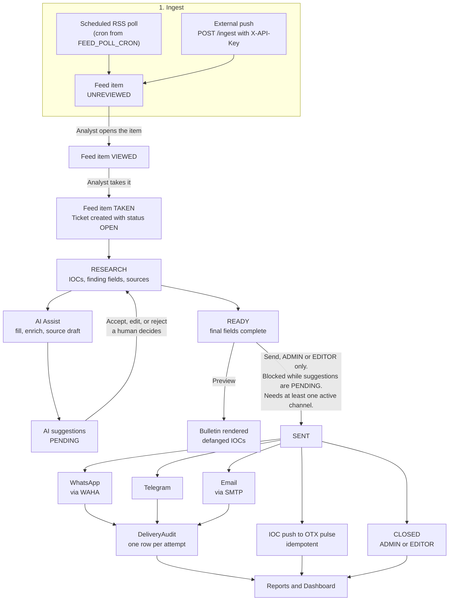
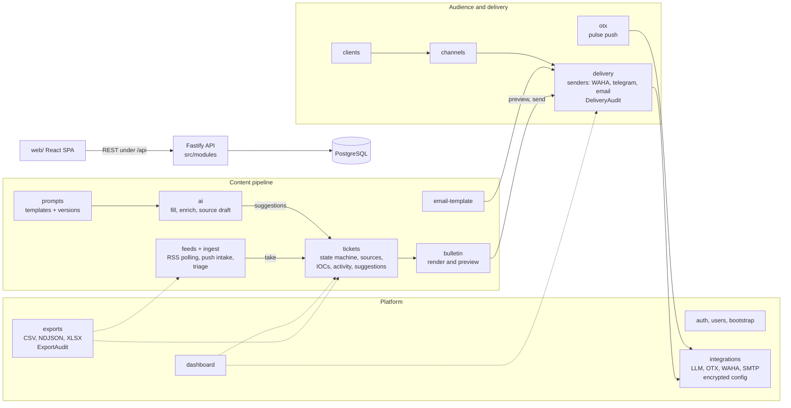
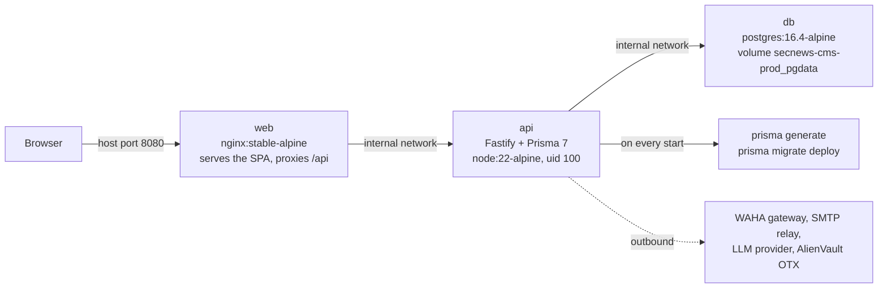

# Architecture & How the App Works (v1.0.0)

SecNews CMS v1.0.0, September 2026.

For endpoint-level detail see [API_CONTRACT.md](./API_CONTRACT.md). Canonical enum values and state machines live in [STATES.md](./STATES.md). Plain-language definitions of terms are in [GLOSSARY.md](./GLOSSARY.md).

## 1. What the app is, and why it exists

Before SecNews, a SOC or MSSP team ran its client bulletin process by hand. Analysts watched RSS feeds, copied interesting indicators into notes, pasted everything into ChatGPT to draft a bulletin, and sent the result through WhatsApp, Telegram, or email. Someone kept a spreadsheet of who received what, and IOCs were pushed to AlienVault OTX one by one. Every step was manual, and none of it left a dependable trail.

SecNews CMS replaces that workflow with one auditable internal platform. It polls feeds on a schedule and accepts pushed items from external collectors. Analysts triage feed items into tickets, work them with AI help, review every AI suggestion by hand, and render a client bulletin with defanged indicators. Sending goes out through client channels, each attempt is audited, and marked IOCs are pushed to an OTX pulse. The stack is a React SPA (`web/`) served by nginx, a Fastify API (`src/`) with Prisma 7, and PostgreSQL.

The theme running through the whole design: the platform can help draft, but it never decides. A human accepts, edits, or rejects every AI suggestion, and the system blocks sending while any suggestion is still pending.

## 2. End-to-end workflow

Reading the diagram:

1. **Ingest.** A cron job in `src/lib/rss` polls configured feed sources, and trusted external collectors can push items straight into `POST /ingest` with a shared API key. New items land as feed items in the `UNREVIEWED` triage state.
2. **Triage.** Opening an item moves it to `VIEWED`. Taking it moves it to `TAKEN` (terminal) and spawns a ticket in `OPEN` with origin `AUTO_FEED`, back-linked to the item. Double-taking is rejected with `409 CONFLICT`.
3. **Research.** The analyst records the finding type, writes up fields, and attaches IOCs. AI Assist can fill and enrich fields or draft from a source, but its output arrives as suggestions in `PENDING`.
4. **Human review.** Every suggestion is accepted, edited, or rejected by a person. The ticket cannot reach `SENT` while any suggestion is `PENDING` (hard block, `409 PENDING_SUGGESTIONS`).
5. **Ready and preview.** With final fields complete the ticket moves to `READY`, and the bulletin module renders a preview with IOCs defanged for client eyes.
6. **Send.** ADMIN or EDITOR sends to one or more active client channels: WhatsApp through WAHA, Telegram, or email through SMTP. Every attempt writes a `DeliveryAudit` row. Marked IOCs are pushed to an OTX pulse; the push is idempotent and updates the existing pulse instead of duplicating it.
7. **Close and visibility.** ADMIN or EDITOR closes the ticket. Dashboard and reports show ticket flow, feed volume, and delivery outcomes.

## 3. Module map

The backend is a Fastify API; `@fastify/autoload` mounts each module's `routes.ts` at its directory name. The React SPA in `web/` talks to it over REST, and PostgreSQL holds everything.

Module responsibilities (`src/modules/`):

| Directory | Responsibility |
|---|---|
| `auth` | Login with JWT, password change, auth status |
| `users` | User CRUD, role changes, password resets (ADMIN) |
| `bootstrap` | Creates the first ADMIN when zero users exist; later calls get `409 CONFLICT` |
| `feeds` | Feed source CRUD; feed item listing, viewing, and take |
| `ingest` | External push endpoint `POST /ingest`, guarded by `X-API-Key` (timing-safe compare) |
| `tickets` | Lifecycle: state machine, sources, IOC records, activity log, field validation, suggestion handling |
| `ai` | LLM-backed fill, enrich, and source draft; output becomes suggestions for human review |
| `prompts` | Prompt template management with version history (`PromptRevision`) |
| `bulletin` | Bulletin rendering and preview; applies IOC defanging |
| `email-template` | Email bulletin template management and rendering |
| `clients` | Client records |
| `channels` | Delivery channels per client: WhatsApp, Telegram, Email |
| `delivery` | Sender adapters (`waha`, `telegram`, `email`) plus a `DeliveryAudit` row per send attempt |
| `integrations` | Encrypted credential storage and connectivity probes for LLM, OTX, WAHA, SMTP |
| `otx` | Idempotent IOC push to OTX pulses |
| `exports` | Ticket and feed data export as CSV, NDJSON (JSON Lines), XLSX, with `ExportAudit` |
| `dashboard` | Summary counts and time series |
| `health` | `GET /health` liveness |

Shared helpers live outside modules too: `src/lib/rss` holds the RSS poller and its cron scheduler (`FEED_POLL_CRON`), and `src/common` holds pagination and the error envelope.

## 4. Key design ideas

**Anti-fabrication guardrails.** The AI never invents IOCs or CVE ids. Suggestion acceptance validates CVE ids against `^CVE-\d{4}-\d{4,}$`, stored IOCs are validated before an OTX push, and AI output only ever becomes a `PENDING` suggestion. Sending is hard-blocked while any suggestion is unresolved: the transition to `SENT` answers `409 PENDING_SUGGESTIONS`. A bulletin is always the product of human-accepted content.

**Defanged IOCs in client output.** Bulletins render indicators so a reader cannot click them by accident: dots in domains and IPv4 become `[.]` (`evil[.]com`, `1.2.3[.]4`), URL schemes become `hxxps://` or `hxxp://`, and email addresses become `user(at)evil[.]com`. Hashes, file paths, mutexes, CIDR ranges, and other types are emitted verbatim. Each IOC carries an `include_in_bulletin` flag; only flagged IOCs reach the bulletin and the OTX push. OTX receives raw values, since OTX is machine-to-machine.

**TLP handling.** Tickets carry a TLP level (`CLEAR`, `GREEN`, `AMBER`, `RED`), defaulting to `AMBER`. On OTX push, `CLEAR` maps to the legacy `WHITE` tag, while `AMBER` and `RED` pulses are forced private (`public: false`) regardless of settings. Client-facing handling follows the TLP meaning of each level; see [GLOSSARY.md](./GLOSSARY.md#tlp-traffic-light-protocol).

**Audit trails everywhere.** Four audit surfaces record who did what: `TicketActivity` logs ticket lifecycle events and work, `DeliveryAudit` logs one row per send attempt with its outcome, `ExportAudit` logs every data export, and `PromptRevision` keeps prompt template history. The question "who sent what to whom, and when" always has a database answer.

**RBAC.** Three roles (`ADMIN`, `EDITOR`, `ANALYST`) gate every route. ADMIN manages users and integrations plus everything else. EDITOR runs feeds, clients, channels, and tickets including send and close. ANALYST views and works tickets, and can create only ANALYST users (any attempt at another role gets `403 FORBIDDEN`). The first ADMIN comes from the one-shot bootstrap endpoint.

**DB-backed encrypted integration credentials with env fallback.** WhatsApp (WAHA) and SMTP credentials are configured in the web UI by an ADMIN and stored encrypted in PostgreSQL with `ENCRYPTION_KEY`. Env vars (`WAHA_BASE_URL`, `WAHA_SESSION`, `WAHA_API_KEY`, and SMTP equivalents) still work as a code-level fallback, but the database is the supported path and keeps secrets out of `.env`. Integrations are testable from the UI.

**Idempotent OTX push.** Pushing the same ticket's IOCs again updates the existing pulse rather than creating a duplicate. Re-sending a bulletin or retrying a failed push is therefore safe.

## 5. Ticket status machine

Ticket statuses: `OPEN → RESEARCH → READY → SENT → CLOSED`. There are no backward transitions and no reopen in v1.0.0. `CLOSED` is terminal.

| Transition | Guard | Allowed roles |
|---|---|---|
| `OPEN → RESEARCH` | none | ADMIN, EDITOR, ANALYST |
| `RESEARCH → READY` | none | ADMIN, EDITOR, ANALYST |
| `READY → SENT` | zero `PENDING` suggestions, at least one active target channel, one `DeliveryAudit` row written | ADMIN, EDITOR |
| `SENT → CLOSED` | none | ADMIN, EDITOR |
| cancel: `OPEN`, `RESEARCH`, or `READY → CLOSED` | none | ADMIN, EDITOR |

Guards in detail for `READY → SENT`:

- Any `PENDING` AI suggestion hard-blocks the send with `409 PENDING_SUGGESTIONS`.
- Sending to an explicitly named channel that is inactive gets `409 INACTIVE_TARGET`.
- Every send attempt, success or failure, writes a `DeliveryAudit` row.
- An illegal transition attempt gets `422 VALIDATION`.

Feed-item triage runs a smaller machine of its own: `UNREVIEWED → VIEWED → TAKEN`. `TAKEN` is terminal, and taking a taken item gets `409 CONFLICT`.

## 6. Deployment topology

Production runs as one Docker Compose project named `secnews-cms-prod`, defined by the base `docker-compose.yml` plus the prod overlay `docker-compose.prod.yml`. The dev-only `docker-compose.override.yml` is not merged when both `-f` flags are given.

| Service | Image | Notes |
|---|---|---|
| web | build with `node:22-alpine`, serve `nginx:stable-alpine` | uid 101 (`nginx`); the only published port, host `8080` by default, override with `WEB_PORT` |
| api | multi-stage `node:22-alpine` | uid 100 (`appuser`); no published port; waits for the DB healthcheck, then runs `prisma generate && prisma migrate deploy && npm start` |
| db | `postgres:16.4-alpine` | internal only; data in volume `secnews-cms-prod_pgdata` |

Migrations are automatic: the api entrypoint applies `prisma migrate deploy` on every start, so there is no manual migration step. WAHA is not part of the compose stack; it is an externally hosted WhatsApp gateway that must be reachable for WhatsApp deliveries. All three services run as non-root users.

Two one-click scripts drive the stack:

- `./scripts/setup-prod.sh`: checks Docker, creates `.env` from `.env.example` with freshly generated secrets on first run (an existing `.env` is kept), builds and starts everything, waits for the API healthcheck, then prints URLs and next steps. Safe to re-run. `WEB_PORT=18080 ./scripts/setup-prod.sh` changes the host port.
- `./scripts/down-prod.sh`: stops and removes the stack. Data is kept by default; pass `--volumes` to also wipe the database volume (irreversible).

After the first start, open `http://localhost:8080/bootstrap` to create the first ADMIN, then sign in at `/login`. Sanity check: `curl http://localhost:8080/api/health` returns `{"status":"ok"}`.

---

v1.0.0, 2026-09.
